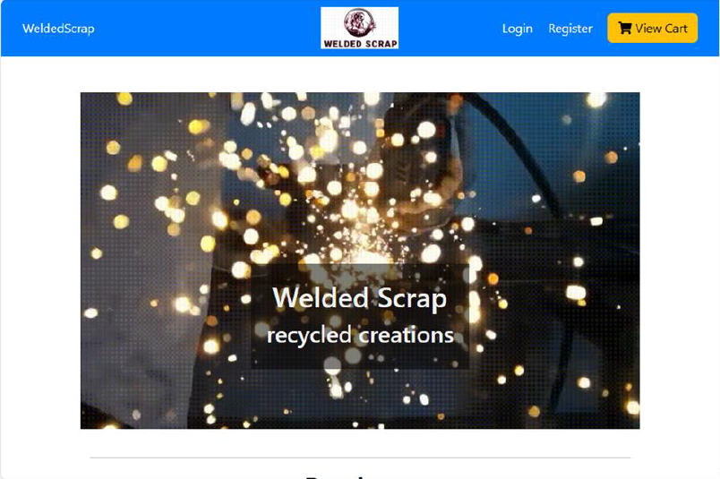

# WeldedScrap

## Table of Contents

- [About this Project](#about-this-Project)
- [Technologies Used](#Technologies-Used)
- [Credits](#credits)
- [License](#license)

## About This Project
WeldedScrap is an e-commerce website, which allows a user to view and purchase various products.

## Technologies Used:
- MySQL
- Servlet
- Java
- JavaScript
- Stripe
- Apache Tomcat

## Usage

## Link:
- [Github Repo](https://github.com/CanadianMRE/weldedscrap)

## Credits
Created as a collaboration of [Alexander Patrick](https://github.com/frenchy8868), [Jaymen Laton](https://github.com/CanadianMRE), [Marley Bautista](https://github.com/marlsmarsbars), and [Gurshaan Gill](https://github.com/GillSlays).

## License
MIT
